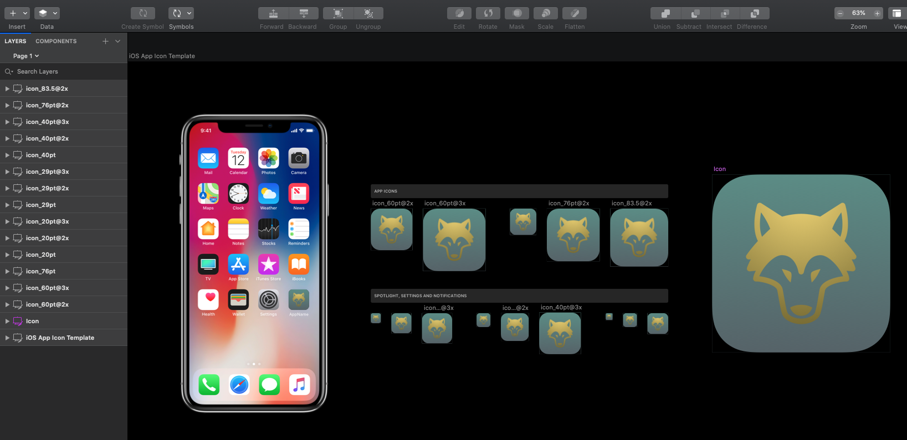

# WOWS Tip Calculator

A universal iOS app that calculates a tip amount given the bill amount and a tip percentage.

## Overview

I built this app in my 6th week at DevMountain. We were tasked with applying our new knowledge in UI to a calculator design of our choice. I built this completely on my own from scratch.

## Design

WOWS is minimalist and simple.

The focus is on the large number in yellow labelled "Tip this". It's at the top, rather than at the bottom of an Excel spreadsheet.

There's no "Calculate Tip" button. I found a way to programmatically update the "Tip this" number as soon as the user dismisses the Number Pad keyboard.

The two inputs are surrounded by boxes, suggesting they're editable.

What does WOWS mean? The font used in this app is [Apple's New York](https://developer.apple.com/fonts/). They call it, "a classical serif typeface you can use in the interface or to provide a traditional reading experience." Given the financial nature of the app, I couldn't help but name it after the Scorsese film "The Wolf of Wall Street" (WOWS).

The color scheme credit: [ColorHunt](https://colorhunt.co/palette/170419).

## Design Process

It started with a quick sketch. I just tried to put 3 different ideas down on paper first. After all, paper's cheap; code's expensive. I almost skipped this step, but I'm so glad I did it. I wasn't in love with the 3rd design at first, but it ended up working so well in the end!

One could argue that this was unnecessary given how simple the design is, but I honestly just wanted the practice of working with it, since I've never worked with it before.

Having worked with CSS before, styling is similar but definitely more verbose in Swift. I'm still learning all the nuances, but inheritance is definitely a thing when it comes to styling things like labels, fields, and buttons in Swift, which I love.

## App Icon design

I preserved the color palette for the icon. I had no idea what I was doing when I started. I just started breaking things in the iOS icon template until I could see where I needed to add my own elements. Sketch really is proving itself a useful tool to iOS designers!

Once the template was good to go, I searched the web for a wolf icon and decided upon a PNG that looked pretty good. Wolf Credit: https://www.cleanpng.com/png-computer-icons-gray-wolf-icon-design-clip-art-wolv-2193005/

